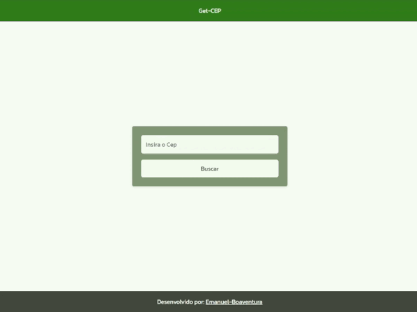

# GetCep

This project was created with the aim of learning how web development works with the [Angular Framework](https://angular.dev/) in version 19. I created a simple application that implements the [ViaCEP API](https://viacep.com.br/) to query address data from a ZIP/CEP code. The first time it returns, it only shows the main data, and when the user clicks on "Ver mais" they are redirected to another page showing all the data returned from the ViaCEP API.

## How to use

You can access [this link](https://get-cep.vercel.app/) to view the project already working on the internet or follow the steps below to download the repository and run it locally.

```bash
# clone this repo and access its folder
$ git clone https://github.com/Emanuel-Boaventura/get-cep.git && cd get-cep

# install dependencies
$ npm i

# start the app
$ npm run start
```

This will open a server at `http://localhost:4200/`. The application will automatically reload whenever you modify any of the source files.

## Demo

<p align="center">
  
</p>
